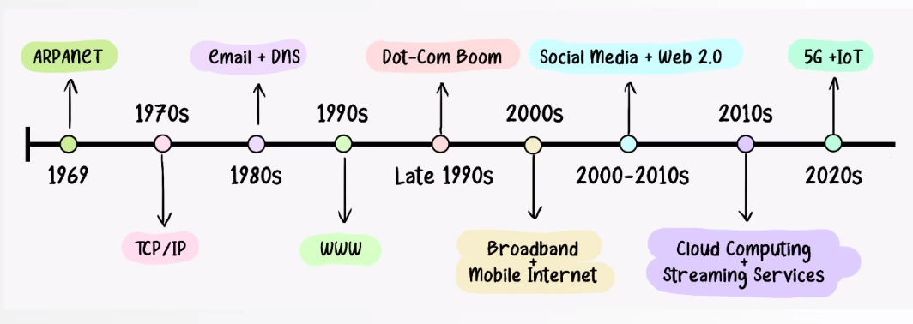
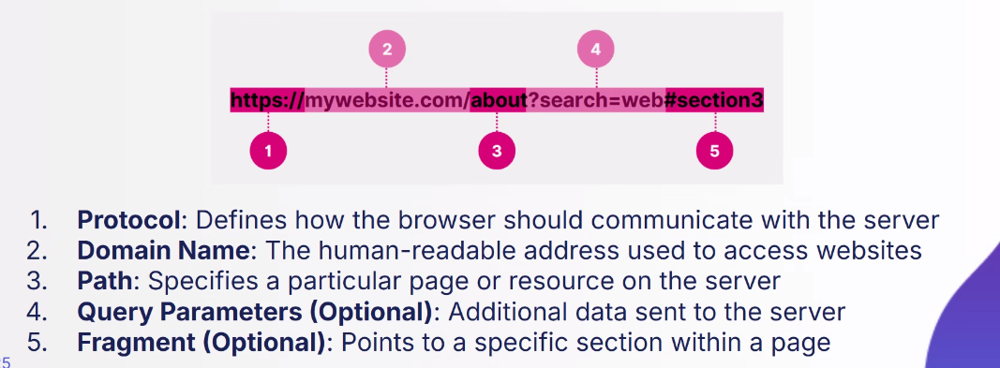
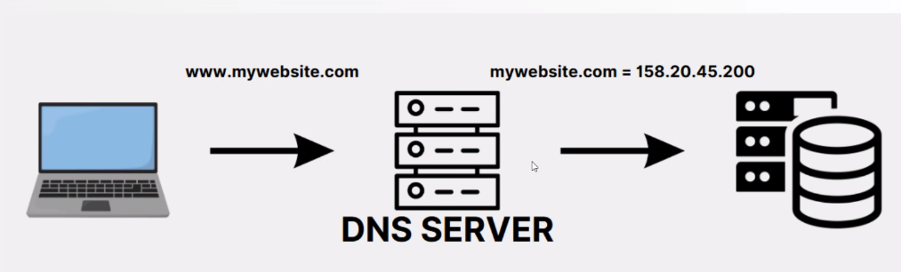
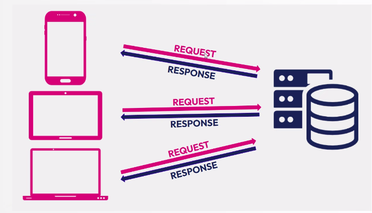
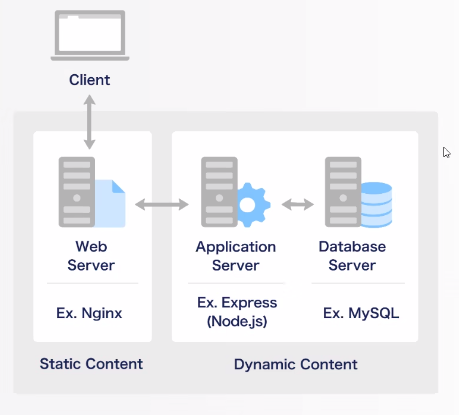
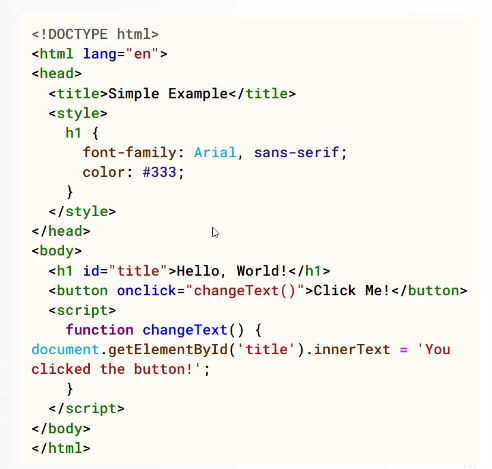

# The Internet

The internet is a global network of **interconnected computers**.

It enables devices worldwide to share and access information through websites, email, and other services.

> **Protocols:** A series of rules for communication.

All data is subdivided into packets.

> **The web** is a system of interlinked documents and multimedia that are connected through hyperlinks.

- **Web:** One particular service of the internet
- **Browser:** A tool to navigate the web.
- **Internet:** The actual network.

> **ISP:** Internet service provider. Acts as the bridge between users and the global internet.
> **Internet backbone:** Made of optic fiber

At the user level, internet access depends on local networks (**LANs**) and various connection types.

## How Data Travels
- The process begins by sending a request to your router/modem. 
- It then forwards the request to your ISP data center.
- At the ISP data center, the request is processed by servers.

## Network Protocols
- **TCP/IP:** Transmission Control Protocol/Internet Protocol
- **HTTP/HTTPS:** HyperText Transfer Protocol/Secure
- **DNS:** Domain Name System

### TCP/IP
These two protocols work together to ensure that the communication between `a` and `b` is efficient and reliable. The difference with the protocol **UDP** is that the protocol gives no reliability.

### HTTP
This protocol defines how a browser and a server exchange content.

HTTP follows a **request-response model**. Every action on the browser triggers a new request to the server.

>**HTTPS** Encrypts data using TLS (Transport Layer Security) ensuring confidentiality and integrity. Provides authentication with an SSL/TLS certificate.

### Other Protocols 
#### UDP
Alternative to TCP that prioritizes speed over reliability. Unlicke TCP, UDP does not establish a connection before sending data or chekc if packet arrives

#### FTP
> **FTP:** File Transfer Protocol

#### SMTP/IMAP
For sending emails

## DNS and IP addressing
A **URL (Uniform Resource Locator)** is the complete web address used to locate resources on the internet. It consist of several parts:
 

> An **IP Address** is a unique numerical identifier assigned to each device connected to the internet or a local network. It allows devices to find and communicate with each other.
- **IPv4:** 4 sets of numbers, around 4 billion of unique addresses
- **IPv6:** A newer version with longer addresses

> **DNS (Domain Name System)** is a system that translate human readable doamin names (like google.com) into machine readable IP addresses 

## Client-Server Architecture
The client-server architecture is a fundamental model of communication in computer networks where clients request services and servers provide them:
- The client is a device (computer, smartphone, tablet) or a software (browser) that initiates a request for a resource
- The server is a machine that stores, processes and delivers the requested resources

- Cliend sends a request
- Server processes the request
- Server sends the response and the HTTP status code
- Server renders the response

### Types of servers in the client-server model
In a client server architecture, different types of servers handle various requests:
- **Web Servers:** Handles HTTP/HTTPS requests and delivers web pages
- **Application Server:** Processes business logic and dynamic content
- **Database Server:** Stores and manage structured data
- **Files Server:** provedes access to shared files over a network
- **Authentication Server:** Manages user authentication and access control

## Web Pages
- HTML -> Markup
- CSS -> 
### HTML
A web page is a document that is accessed through the internet and displayed in a web browser. It is primarily written in **HTML**, but it also contain elements like **CSS** for styling, **JavaScript** for interactivity, and multimedia content such as images and videos

Each web page is identified by a unique URL, which serves as its address on the internet

HTML Stands for **HyperText Markup Language**, it uses tags to define the role of each element on the page

An HTML docuemnt starts wtih the `<!DOCTYPE html>` declaration, which tells the browser that the document is written in HTML5

An html page consists of 3 main secitons:
- `<html>` The root element that contains the entire web page content
- `<head>` Includes metadata, links to stylesheets and scripts that help define how the page behaves
- `<body>` Contains the visible content of the page

### CSS 
Css stands for **Cascading Style Sheets** is a language used to define the appearance and layout of a web page

CSS is made of rules, composed by a selector and a set of declarations enclosed in curly braces `{}`. Each declaration is made up of a property and a value separated by a colon `:` 

### Javascript
JS is a programming language that makes web pages interactive. JS allows developers to create dynamic content, respond to user actions, and manipulate the page in real time

## Static vs Dynamic web pages
Static web pages contain fixed content written in HTML and CSS. The content remains the same for all users and only changes when manually updated by a developer
- Simple and fast to load
- No database interaction
- Suitable for informational sites, blogs and portfolios

Dynamic web pages generate the content in real time, often based on user input and data from a database

## Web Technologies
There are many other technologies and tools that power full fledget web applications:
- **Backend Languages:** Handle server side logic, database interaction and business processes
- **Databases**
- **Web Frameworks**
- **APIs:** Enable communication between the frontend and backen or with external services
- **DevOps & Cloud Services** (e.g. AWS, Docker), manage hosting, deployment and scaling of applications

## Tools for the course
- VSCode
- Prettier (VSCode Extension)
- Live Server (VSCode Extension)