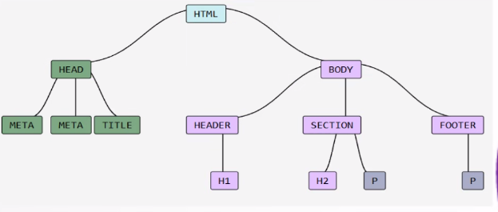
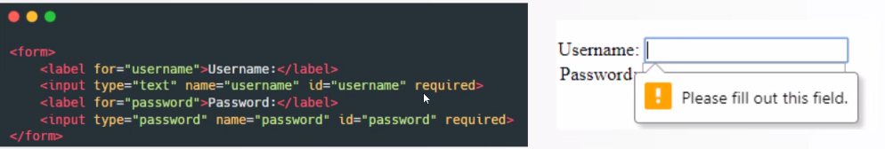

# HTML

- HTML stands for *HyperText Markup Language*
- **It is not a programming language**, it is a markup language
- "Markup language" means that it utilizes tags to provide a semantic structure
- HTML5 is the latest version of html
- All the tags are written inside these parentesis `<>`. The Browser is then able to render the content of the page based on the tags

## Tags
- **Opening tag:** This tells the browser that the content inside it is a paragraph
- **Content:** The actual content of the element, which will be displayed to the user
- **Closing tag:** This tag indicates the end of the paragraph

Some tags don't require the closing tags

## DOM
> The **Document Object Model (DOM)** is a programming interface for web documents. It represents the structure of a webpage as a tree of objects, where each element is an object that can be manipulated with JavaScript. 

> It is basically like an outliner

- The `<html>` element is the root of the tree
- The `<head>` and `<body>` elements are child nodes
- All other elements are further child nodes

## Basic HTML Structure
- `<!DOCTYPE html>` - This indicates that we are using HTML5
- `<html>` - This is the **root** element that wraps the entire HTML element. All other elements are nested inside it
- `<head>` - Header section. Contains all the **metadata** (Information that are not directly visible on the page, but it is used to add things like stylesheet links, title, or other information)
- `<body>` - The effective content of the webpage

### head
- Specifiying character encoding (UTF-8 is recommended)
- Setting other meta-info (keywords, descriptions for SEO)
- Defining the page title
- Linking to external resources (stylesheets, scripts, fonts)

### body

## Basic Tags for Text Elements

###  Headings (`<h1>` to `<h6>`)
> Headings define the hierarchy of content, where `<h1>` is the most important
and `<h6>` the least

⚠ **Headings should not be used just to make text bigger or smaller**; their
purpose is to structure content. Use CSS for styling instead

Usually, we only use **1 h1** per page

---
### Paragraphs `
`

---
### Line Break ` `
To go to the next line

---
### Strong and Emphasis `<strong>` and `<em>`
They emphasize the text (not in a graphical way!)
- `<strong>` by default is rendered bold
- `<em>` by default is rendered in italics

Again, for styling, use CSS, never use `<strong>` or `<em>` just for styling

## Basic Tags for Links and Images 
### Links `<a>` 
The `<a>` **anchor tag** is used to create hyperlinks, which allow users to navigate between pages or websites.
- **href attribute** specifies the destination URL
- **target=_blank** opens links in in a new tab
- Links can also point to specific sections of the same page by using **anchor links** (e.g. #section1)

---
### Images ``
- The **src attribute defines** the image location (URL or relative path)
- The **alt attribute** is essential for accessibility and provides text for screen readers (always include an alt test as best practice for better SEO and accessibility)
- The img tag is a **self closing tag** (meaning it does not require a closing tag), in HTML5 it is not even necessary to include the slash at the end (`/`)

## Lists
The elements of the list are identified by the tag `<li>` **list item**

---
### Unordered Lists `<ul>`
List with no order (bullet points) 
---
### Ordered Lists `<ol>`
List with numbers

## Tables
The main tag is `<table>`. Each **row** is defined by the tag `<tr>` (table row).

Each cell within a row is defined by the `<th>` (table header) and `<td>` where i put the actual data

## Forms
> Forms are used to collect input. It consists of several form elements, such as text fields, checkboxes, ecc.

The `<form>` tag is the foundation of any html form. Some important attributes:
- **action:** Specifies the URL where the form data will be sent when the form is submitted
- **method:** Defines how data will be transmitted. 

Nowadays though, this transmission is handled on JS instead

### **input type = "text"** 
A single line test input, used for short text like names or search queries

---

### **input type = "password"**
Similar, but the characters entered are hidden by default 

---

### **input type = "email"**
It validates the email format automatically

---

### **input type = "number**
This allows the user to enter only numbers

---

### **input type = "date**
This allows the user to enter a date

---

### **input type = "checkbox**
Creates a checkbox

---

### **input type = "radio**
Creates a radio button

---

### Some other input types:
- **file**
- **range**
- **tel**
- **color**
- **search**
- **hidden**

---

### `<Textarea>`
Specific tag to create a multiline text area

---
### `<label>` tag
Used to add a table to an input field

---
### The `required` attribute 
Ensures that a field must be filled before submitting the form

---

### The `name` attribute
Plays a crucial role in form submissions. Needed as a selector for JS or for making radiobuttons parented

---

### The `value` attribute
defines the data associated with an input element when it is
selected or filled in

---

### Other attributes
- **checked:** This attribute is used for checkboxes and radio buttons to
specify that the input should be selected by default
- **readonly:** When applied to input fields, this attribute makes the input field
uneditable. It can be useful when displaying information that cannot be
changed by the user
- **min and max:** These attributes set the range of values that can be entered
in input fields such as number, date, or range. They help limit the user's
input to a specified range
- **placeholder:** The placeholder attribute provides a short hint within an
input field that shows up when the field is empty. It's used to guide the
user on what to input

## HTML5
HTML5
focuses on semantic elements, multimedia integration, and better support for
web applications. S

ome key improvements introduced in HTML5 include:

- New semantic elements like `<article>`, `<section>`, `<header>`, and `<footer>`
that improve document structure and accessibility
- Native support for embedding audio and video with the `<audio>` and
`<video>` tags

HTML5 introduced several new **semantic elements** that make it easier to
structure web content logically and improve accessibility for screen readers
and search engines.
- `<header>`: Represents introductory content or navigational links for a
section or document.
- `<footer>`: Represents footer content for a section or document, often
containing author information or copyright details.
- `<article>`: Represents independent content that could be distributed or
reused (e.g., blog posts, news articles).
- `<section>`: Represents a thematic grouping of content, typically with a
heading.
- `<nav>`: Represents navigation links for a page or section of a site.
- `<aside>`: Represents content that is tangentially related to the content
around it (e.g., sidebars, pull quotes)

Here are some key reasons why they matter:
- **Improved Accessibility:** Semantic tags like `<header>`, `<nav>`, `<article>`,
and `<footer>` help screen readers interpret the structure of a page more
effectively, providing a better experience for users with disabilities
- **Better SEO (Search Engine Optimization):** Search engines can better
understand the context of the content. For example, using `<header>` and
`<footer>` elements properly helps search engines recognize important
parts of the page
- **Code Maintainability:** Semantic elements make code easier to read and
maintain. Developers can easily understand the role of each section of the
page, which is crucial for long-term maintenance and collaboration
- **Consistency Across Browsers:** By using semantic HTML, browsers and
devices can better interpret and display content consistently, improving
the user experience across different platforms

### HTML5 Multimedia
HTML5 simplifies embedding media content with the `<audio>` and `<video>`
tags, allowing native playback of audio and video. Both tags support multiple
file formats and have various attributes for control, such as controls, autoplay,
loop, and muted

## Metadata and SEO

Metadata in HTML refers to the data that describes the content on a webpage
but isn't directly visible to users. This data is crucial for search engines and
web crawlers, improving SEO and the visibility of
your webpage

Some key metadata elements include:
- `<meta>`: Provides information like character encoding, viewport settings,
and description for SEO
- `<title>`: Sets the title of the webpage, which appears in the browser tab
and is crucial for SEO
- `<link>`: Used to link external resources like stylesheets and favicons.
- `<meta name="description" content="...">`: Describes the content of the
page, used by search engines to display page summaries in search results

1. **Meta Description:** Provides a short overview of the page, useful for
attracting users from search engines
2. **Meta Keywords:** Includes relevant keywords for web development
courses, enhancing visibility
3. **Meta Robots:** Tells search engines to index the page and follow links within
it
4. **Open Graph Tags:** Improves the appearance of the page when shared on
social media (with customized images, title, and description)
5. **Title:** The title of the page, visible in the browser's title bar and search
engine results
6. **Charset:** Sets the character encoding to ensure correct display of content
in all languages.