# CSS

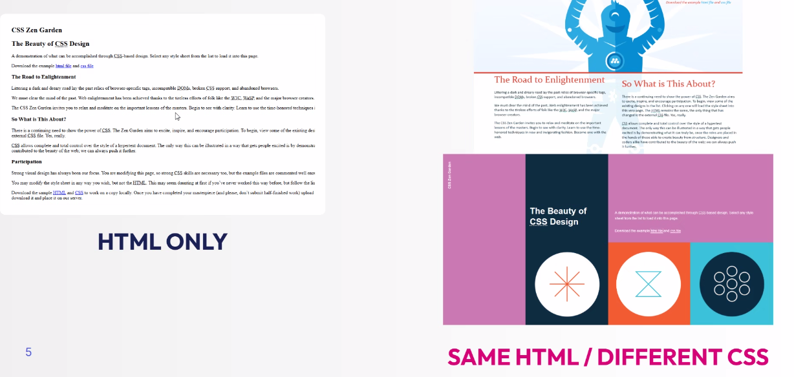

> CSS: **Cascading Style sheets**

It is a language used to define the appearance of web pages

The latest version is **CSS3**

## How CSS works with HTML
- **HTML is the structure** of the web page, it defines the content and elements that appear on the page.
- **CSS is used to style these elements**

It is important to **separate structure from style** by keeping HTML and CSS distinct

## Ways to apply CSS
- **Inline CSS** - Styles applied directly within an HTML element using the `style` attribute
- **Internal CSS** - Styles defined inside a `<style>` tag within the html document
- **External CSS** - Styles stored in a separate `.css` file and linked to the HTML document (preferred) 

### Inline CSS
⚠ NOT SUGGESTED
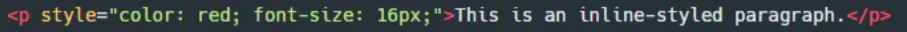

### Internal CSS
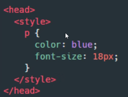

### External CSS
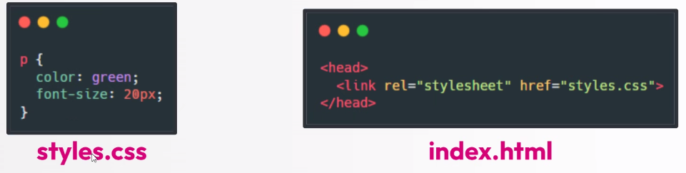

## CSS syntax overview
CSS follows a simple and structured syntax, where styles are defined using **selector, properies and values**

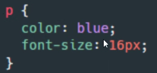

In this rule:
- `p` is the **selector** (targets all `
` elements)
- `color` and `font-size` are **properties**
- `blue` and `16px` are **values** 

## CSS Selectors
### Basic Selectors
- **Element Selector** also called **type selector** - targets **all HTML elements of a specific type**
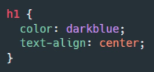

---

- **ID selectors** - In HTML, both **ID** and **class** attributes are used to assign names to elements. **ID is a unique identifier** meaning it should be used only once per page
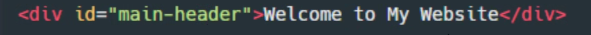

    In CSS, id selector uses a `#` simbol followed by the **id name** 

---

- **Class selectors** - **A class is a reusable attribute**, allowing multiple elements to share the same style. It is useful for grouping elements that should have the same appearance
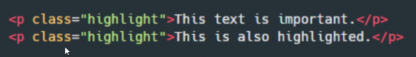

    In CSS, class selector uses a `.` simbol followed by the **class name** 
---

- **Universal Selector** - It is denoted by the asterisk `*` and it selects **all the elements**
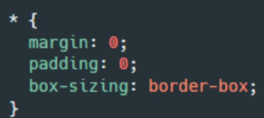

---

- **Group Selectors** - allow you to apply the same style to multiple elements by combining their selectors into a single rule. This reduces redundancy and simplifies your CSS
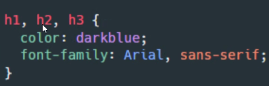

---

### Advanced Selectors
- **Attribute sleector** - target elements based on the presence or value of specific attributes in HTML tags

    - `[type^"text"]`: type starts with text
    - `[type$"text"]`: type ends with text
    - `[type*"text"]`: type contains text

---

- **Descendant Selectors** - Target elements that are nested within a specific parent element, regardless of how deep the nesting is For instance, this rule applies styles to all `
` elements that are descendants of a `div`.  
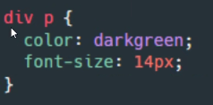

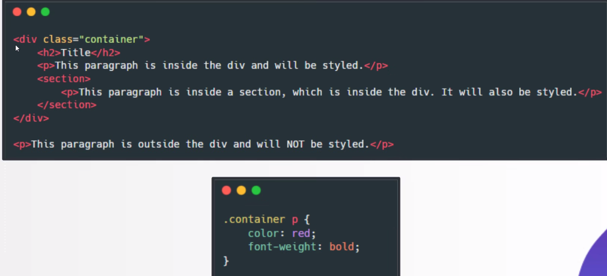

--- 

- **Adjacent sibling selector (+)** - selects an element that is immediately after a specified element, but only if both share the same parent.  

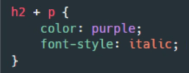
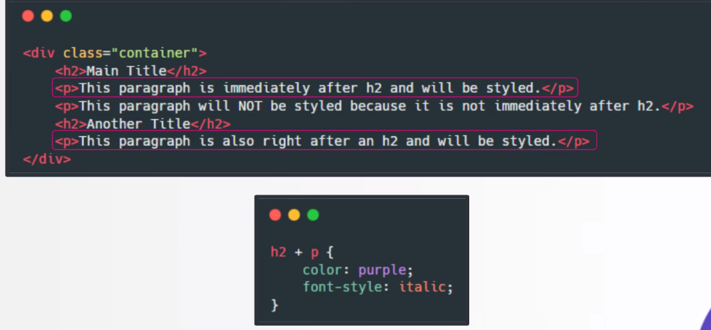

---

- **Pseudo-classes** - allow you to apply styles to elements based on their state, position or interaction without modifying the HTML structure. They are written with a **colon** `:`
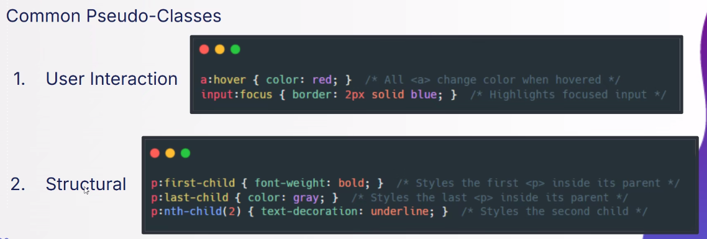

The most useful pseudo classes include `:hover`, `:active` - for when an element is being clicked, `:focus`, which is used when an element such as an input field gains focus.

`:first-child` and `:last-child` are other useful ones.

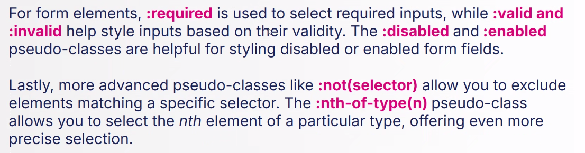

## Cascading
CSS stands for **Cascading style sheets**, and cascading refers to how styles are applied when multiple rules affect the same element.
Priority system>
- **Source Order**: The last defined rule takes precedence. CSS follows a **top to bottom order** when applying styles
- **Specificity**: More specific selector override more generic ones. CSS assigns **weights** to different selector types:
    - Element Selector: Least specific
    - Class Selector: More specific
    - ID Selector: Most specific

    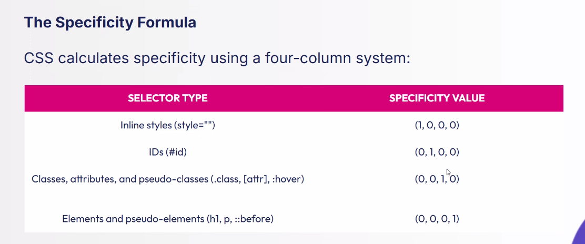

    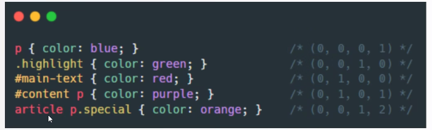
    
    ⚠ inline styles always have the precedence 

    > calculator for specificity> https://specificity.keegan.st/ 
    VsCode tells me the specificity too by hovering on the selector
- **Importance**: The `!important` declaration

## CSS Properties
### Units
- **Absolute Units:** Have a fixed value that does not change relative tot he environment or surrounding element. They are ideal when you need precise, consistent sizing
    - `px` (pixel)
    - `in` (inches)
    - `cm`
    - `mm`
    - `pt` (points)
- **Relative Units:** Are based on the context in which they are used. These units adjust their value according to a reference point like the font size of the parent element, the size of the viewport or other dynamic factors.
    - `em` (relative to the font size of the parent). `em` scales based on the font size of the parent element , making it suitable for nested, relative sizing
    - `rem` (relative tot he root element's font size). Scales based on the root element's font size (Usually the `<html>`) tag, making it easier to manage global typography
    - `%` (relative to the parent container's dimension). The value is always calculated as a percentage of the parent element's size, making it ideal for flexible layouts. It is heavily used in grid and fluid layouts to create designs that adjust to screen size.
    - `vw` (viewport width) relative to the visible area of the browser window. 1 vw is 1% of the viewport's width. 
    - `vh` (viewport height) relative to the visible area of the browser window. 1 vh is 1% of the viewport's height.

    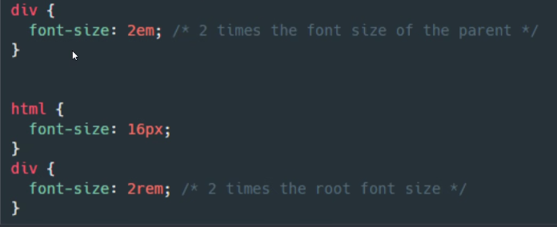

    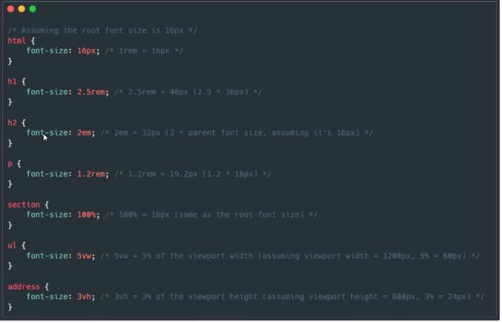

    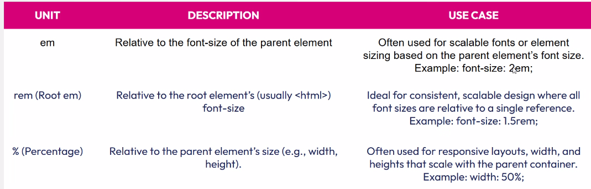

    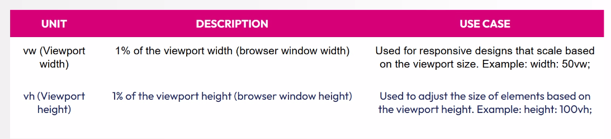

### Typography
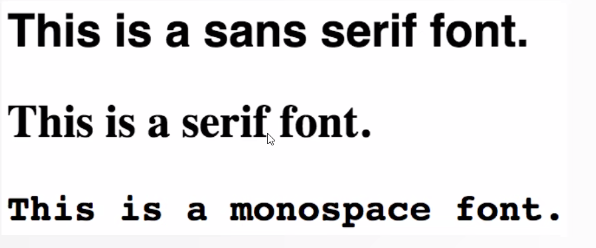

In css you can apply ofnts using the font-family property.

- Basic Syntax: `font-family:"Font Name", generic family`
- Font Stacks: It is common to provide multiple choices in case the first one isn't available

In addition, css also allows you to adjust the weight and the style fo the font
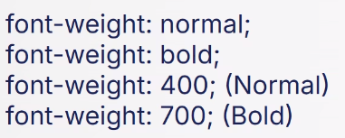
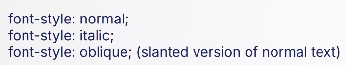
`line-heigth`: property to control spacing between the lines

Google fonts is a collection of open source fonts. I just need from google fonts to copy the embed code
