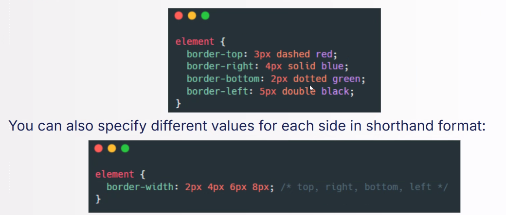
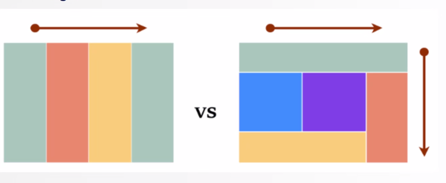
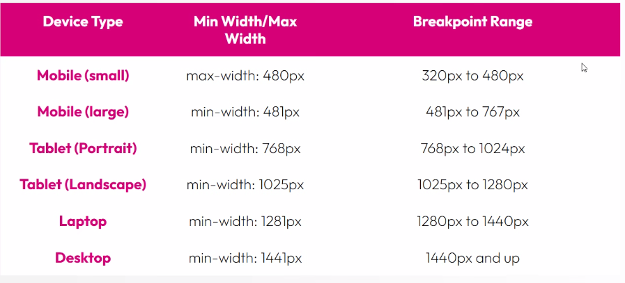

# Advanced CSS
## The Box Model
> The Box Model is a fundamental concept in CSS, used to define the layout of elements on a webpage. Every element on a page is represented as a box, which consists of four key parts:
- The inner content
- Padding (Space between the content and the border)
- Border
- Margin (External to the element, represents the spacing between the element and another)

### Padding
It can be defined using the shorthand `padding` property, which accepts one, two, three or four values, or by specifying `padding-top`, `padding-bottom`, `padding-left`, `padding-right`

### Border
A border consists of three main customizable properties:
1. `width`
2. `style` - Defines how the border appears (solid, dashed, dotted, etc.)
3. `color`

instead of applying the same border to all sides, you can define individual borders

> You can create rounded borders with `border-radius` 

### Margin
The `margin-auto` rule is often used to center block-level elements horizontally so that the element is equally spaced inside its container

The 0 on top and bottom margin ensures no extra space is added vertically

As a more modern alternative, you can use `margin-inline:auto`

⚠ When two elements are adjacent to each other, CSS may collapse the margin, taking the larger of the two values

### Box Sizing

In CSS, the default `box-sizing` value is `content-box`, but `border-box` is often used for more predictable layout behavior
- `content-box` The width and the height properties only apply to the content of the element, not including padding or borders. When you set a width or heigth, the padding and border are added outside, increasing its total width and height.

- `border-box` The final size of the element will always be the specified one, so the padding and border are included in the size specified

## Positioning
CSS Positioning is a method that allows you to control the positioning of elements on a page

- `static` - Default
- `relative` - elements are positioned relative to their original position in the document flow. This means that the element's oisutuib us adjusted using the `top`, `right`, `bottom` and `left` properties. **This does not remove the element from the document flow.** Other wlements around it will behave as though it hasn't moved, leaving gaps where the element originally was
- `absolute` - Takes an element out of the normal document flow and position it relative to its lcosest positioned ancestor (**i.e. the nearest ancestor with a position other than static**). If there is no such ancesto, the element will be positioned relative to the `<body>` of the viewport. When you apply absolute positioning, the element is placed exactly where you want it, using the `top`, `right`, `bottom` and `left` properties. Absolute leaves no spaces where the element originally was, meaning it can overlap other content. The layout of surrounding elements won't adjust to accomodate the absolutely positioned elements
- `fixed` - allows an element to be poistioned relative to the browser window. When an element is given `position:fixed`, you can use the `top`, `bottom`, `left` and `right` to adjust
- `sticky` - An element behaves like a relatively positioned element, until a **specified scroll point** is reached. Once that point is passed, it "sticks" in place and behaves like a fixed element 

## Display

The `display` property is crucial, as it determines how an HTML element will be displayed on the page and how it will interact.

By default, many elements like `
` are **block elements**, meaning they take up the full width available and start on a new line. Other elements like `` are **inline**, meaning they adjust to the surrounding content without forcing a line break

The display property offers several values that can change an element's behavior, such as `block`, `inline`, `inline-block`, `none`, `flex`, `grid` and more

- **block elements** - These elements, like `
`, and `<h1>` occupy the full width of the container. 
- **inline elements** - They occupy only the needed space. I can's specify their size

- **inline-block** -the element stays on the same line (no line break). It allows you to set margin, border and padding

- **None** - the element is **removed from the element flow**
- **FlexBox** and **CSS Grid** 
    - Flexbox is designed for one dimensional layouts
    - Grid for two dimensional layouts

## Flexbox

Flexbox is a powerful layout tool in CSS that allows you to design complex layouts with ease. It simplifies the alignment and distribution on space between items within a container

When using flexbox, elements inside a flex container follow a specific direction, determined by the `flex-direction` property. This creates two key axes:
- **Main Axis** - The primary axis along which flex items are placed and aligned
- **Cross Axis** - Perpendicular to the main axis

> `flex-direction` - Defines the main axis. Determines wheter items are arranged in a row (default), column, or reverse order

When the flex-direction is set to column, the main and cross axes change their positions 

> `justify-content` - Aligns items along the main axis. Defines how space is distributed between flex items

> `align-items` - Aligns items in a single row or column, determinates how flex items are positioned along the cross axis

> `flex-wrap` - Controls item wrapping. By default, items stay on one line. 
- `nowrap`
- `wrap`
- `wrap-reverse`

> `align-content` - Controls the alignment of multiple rows

> `flex-flow` - combines `flex-direction` and `flex-wrap`

>`gap` - Defines the space between elements

> `flex-grow`/`flex-shrink` - Controls how items expand to fill extra space or how items shrink when the space is limited

## Responsiveness and Media Queries

Media queries allow developers to create styles that adapt based on the characteristics of the device being used, such as screen size.

The syntax of a media query consists of a keyword `@media`, followed by a condition that specifies when the query should be applied. The condition typically targets a device feature, like the width or height in the viewport

**Mobile-first** design is an approach to web development where the design and the layout of a website are initially created for mobile devices. 

when using `min-width` the base design is for mobile, and styles for bigger screens are progressive adjusted (mobile first approach)
when using `max-width` the base design is for desktops, and styles for smaller screens are progressive adjusted (desktop first approach)

`orientation` - Detects if the device is in `portrait` (vertical) or `landscape` (horizontal)mode

## CSS Reset vs Normalize.css

**CSS Reset**: Removes all default browser styles, making sure that every element starts with no margins, padding, or other predefined rules. This provides a clean state.
**CSS Normalize**: Keeps useful default styles while ensuring consistency between browsers