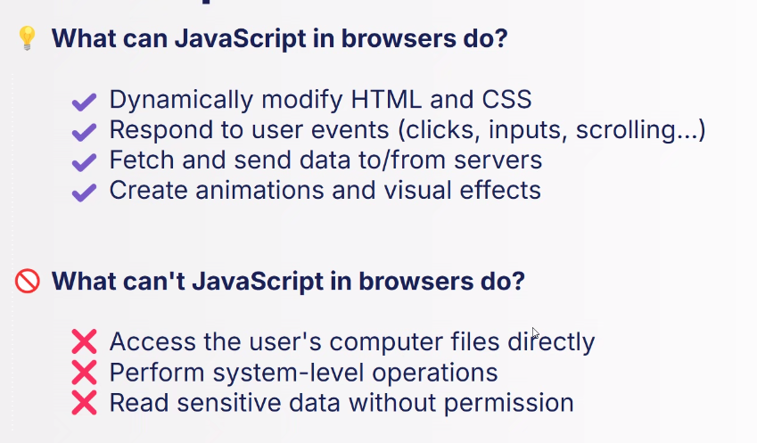

# Introduction to Javascript
JS nowadays is everywhere. IT is the most widely used programming langage for web development

Originally it started as a simple scripting language for adding basic interactivity to web pages, then thanks to a technology called **Node.js**, it became a language available server-side too

> **Programming:** The art of giving instructions to a computer to perform tasks

## Data Types
- Numbers
- Strings
- Booleans
- Objects
- Null
- Undefined. A variable declared but with no value assigned
- NaN (es `"hello"/2` returns a NaN)
- Infinity (es `10/0` returns infinity)

## JS 
> JS is **Dynamically Typed**


JS runs in **engines** that interpret and execute the code. The engine is responsible for compiling and executing JS, some examples:
- V8 Engine (Chrome, Node.js)
- SpiderMonkey (Mozilla)

## Hello World

```
console.log("Hello World")
```

This is a function that prints output to the browser's console. It can be executed either from the browser console or inside an HTML page

## Where to add JS to an HTML page
1. Inline JS
2. Internal JS
3. External JS 

The third one is the best choice. We need to link the file using the `<script>` tag

- If the script is in the `<head>` this will get executed before the page gets loaded. It could slow down the entire page loading
- If the script is at the end of the `<body>`, it will be loaded after the page is loaded

## Variables
- `let` For a variable that can change
- `const` For a variable whose value cannot change after


The general rule is using `const` when we don't need the variable to change

```
let age = 25
age = 25
```
- `var` is an old way of declaring variables, we shouldn't use it anymore

## Comparison Operator
- **Equal to (==)**/**Not Equal to (!=)** Compares if two values are equal (**ignores type**)
- **Strict Equal to (===)**/**Not Equal to (!==)** Compares if two values are equal **and of the same type**

**Always use `===`**

## Logical Operators
1. **AND `&&`**
2. **OR `||`** (This symbol `|` is called *pipe*)
3. **NOT `!`**

## Objects 
Objects are crucial because they allow us to model real world entities and manage complex data in an organized way

It should generally be const
```
const product = {
    name: "Laptop",
    price: 9999,
    stock: 50,
    category: "Electronics",
    discount: 10,
    "main color": "blue"
}
```

to access properties we use **dot notation** (rarely the **bracket notation**)

```
product.discount
// or
product["discount"]
```

If there are spaces in properties, we need to use brackets, and we need to use the bracket notation
```
product["main color"]
```

If we need to **clone** an object, we need to use the `assign` method, otherwise it will just create a reference and modifying one will modify the other

```
const person1 = {name: "John", age: 20}
const person2 = Object.assign({}, person1)
```