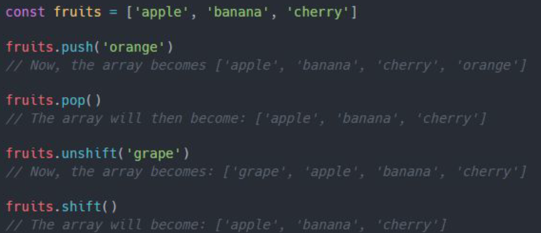

# Arrays
> Arrays allow you to store multiple values in one variable

## Create an Array
Arrays can be created in a few different ways, but the most common approach is by using the **array literal syntax**. To create an array, you simply use square brackets `[]` and place the elements inside, separated by commas

Another way to create an array is by using the `Array` constructor.

Once an array is created, you can access its elements using an **index**. *In JavaScript, array indices start at 0*

## Length
Every array has a `length` property, which tells you how many elements are in the array.

⚠ If you try to access an index that doesnʼt exist, youʼll get undefined

## Adding, Removing, Replacing Elements

Replacing an element in an array is simple as reading it. To replace a value, you just access the index of the element you want to change and assign a new value to it

To add elements to the end of an array, you can use the `push()` method

If you want to remove the last element, you can use the `pop()` method:

You can also add or remove elements at the beginning of an array. To add an element to the start, use `unshift()` and to remove the first element, use `shift()`:

⚠ Itʼs generally better practice to avoid mixing different types in an array unless necessary, as it can lead to confusion and bugs in your code

# Conditionals
Conditional statements allow you to perform different actions based on different conditions

## If Statement
The simplest conditional statement in JavaScript is the `if` statement

## Else Statement
The `else` statement is used to execute a block of code when all previous conditions are false. Itʼs the final fallback when no other conditions are met.

## Else if
To handle multiple conditions, you can chain `else if` statements together

## Switch
The `switch` statement is a more efficient way to handle multiple conditions when you are checking a single variable against different possible values. Unlike the if-else statements, which are better suited for complex conditions, the switch statement is great for checking a variable's value against multiple possible cases.

### Key Components
- `expression`: The variable or expression you want to test against multiple values
- `case`: Each case checks if the expression is equal to a specified value. If it matches, the corresponding block of code will execute
- `break`: Prevents the code from running into the next case (also known as "fall-through"). Once a match is found and code is executed, break exits the switch statement
- `default`: An optional case that runs if none of the case conditions match. It acts as a fallback

# Loops
Loops are fundamental constructs in programming that allow you to repeat a block of code multiple times, based on a condition. JavaScript provides several types of loops to handle different looping scenarios

## For Loop
The `for` loop is used when you know in advance how many times you need to repeat a block of code

- `let i = 0` Initializes the loop counter
- `i < 5` The condition that keeps the loop running as long as it evaluates to
true
- `i++`: The increment that updates the counter after each loop iteration

## While

The while loop repeats a block of code as long as a specified condition is true. 

- `let i = 0` Initializes the loop counter
- `i < 5` The condition that keeps the loop running as long as it evaluates
to true
- `i++` The increment that updates the counter after each iteration

A while loop is perfect when the number of iterations is not known in advance

## Do While

A `do-while` loop is similar to the while loop, except that it guarantees the loop
body will run at least once before checking the condition. This is useful when
you need to ensure an operation occurs at least once, such as showing a
prompt or performing an action before validating a condition

- The loop runs at least once and asks the user to enter a password
- It checks if the entered password is '12345'
- If the password is incorrect, the loop repeats and asks for the
password again
- Once the correct password is entered, it prints "Password accepted!"
and stops